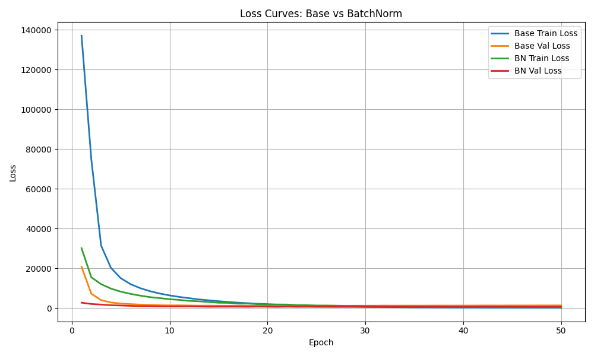

# Batch Normalization: Accelerating Deep Network Training by Reducing Internal Covariate Shift

**Paper:** [Batch Normalization: Accelerating Deep Network Training by Reducing Internal Covariate Shift (Sergey Ioffe et al., 2015)](https://arxiv.org/abs/1502.03167)

## Problem
딥 뉴럴 네트워크에서는 학습이 진행되면서 각 Layer의 가중치가 지속적으로 업데이트된다. 이때 특정 Layer의 출력 분포는 다음 Layer의 입력 분포가 되므로, **가중치 변화에 따라 Layer 입력 분포가 계속 달라지는 현상이 발생한다.**
논문에서는 이를 **Internal Covariate Shift**라고 칭한다.

Internal Covariate Shift가 크면:
- 각 Layer는 **매 step마다 달라지는 입력 분포에 적응해야 하므로** 학습이 느려진다.
- 안정적인 학습을 위해 **학습률(learning rate)을 작게 설정**해야 한다.
- 초기 가중치 값에 학습 성능이 크게 영향받는다.
- 특히 sigmoid 같은 saturating nonlinearity는 입력이 크게 치우치면 gradient가 거의 0이 되어 학습이 정체된다. (*추후 ReLU 계열 활성화 함수가 양수 구간에서 일정한 gradient를 유지하며 이러한 문제를 실용적으로 완화)

이러한 문제로 인해 딥 뉴럴 네트워크는 효과적으로 학습시키기 어려웠다.

Internal Covariate Shift를 줄이기 위해 (입력 분포을 최대한 고정) 진행되었던 기존 연구 중 하나는 입력값들에 대해 Whitening 기법(LeCun et al., 1998)을 적용하는 것이었다. 해당 기법은 입력 전체에 대해 주기적인 Normalization을 통해 입력값들이 평균을 0, 분산을 1로 정규화하고 feature간에 상관성을 제거하는 작업을 통해 입력 분포를 최대한 고정시키려는 시도이다. 

그러나 Whitening은 계산 비용이 매우 크고(covariance 행렬과 이의 inverse square root를 구해야함) 정규화를 네트워크 외부에서 따로 진행해주는 경우 Gradient descent가 의도한 가중치 업데이트를 상쇄시켜 학습은 되지 않고 Bias값만 계속 증가하는 문제가 생긴다. 따라서 Normalization을 네트워크 내부에 포함되어야 하며, 모델 가중치 업데이트가 정규화 연산의 존재를 고려해서 이루어져야한다. 

## Proposed Idea
본 논문은 앞서 소개된 문제점에 대해 Batch Normalization (BN) 기법을 제안한다. BN 기법은 계산량을 줄이기 위해 입력의 각 feature단위로 정규화를 한다. 아래는 BN Layer를 수식으로 표현한 것이다.

$$
y^{(k)} = \gamma^{(k)} \frac{x^{(k)} - \mathbb{E}[x^{(k)}]}{\sqrt{\mathrm{Var}(x^{(k)}) + \epsilon}} + \beta^{(k)}
$$

위 수식에서 $\gamma$와 $\beta$를 학습 가능한 파라미터이며 이 둘은 모델의 표현력을 보존하는 역할을 한다. 예를 들어 BN의 입력이 정규화 과정을 거치지 않고 그대로 출력(identity transform)되는 것이 가장 좋은 결과를 이끌어낸다면 $\gamma$아 $\beta$는 각각 분산항과 평균항의 효과를 상쇄시키도록 학습된다.

Batch Normalization는 각 Layer의 출력과 활성화 함수 사이에서 수행되며 shift 효과를 포함하고 있어 직전 Layer의 bias를 더 이상 사용하지 않아도 된다.

Batch Normalization 사용 효과
- Internal Covariate Shift 감소: 각 레이어의 입력 분포가 학습 중에 안정적으로 유지
- 학습 속도 향상 (더 큰 Learning Rate 사용 가능)
- 가중치 초기값에 덜 민감함
- Saturating Activaiton 문제 완화: sigmoid, tanh 등의 입력이 과도한 값으로 치우치는 것을 막아 gradient vanishing 현상 방지
- Regularization 효과: mini-batch 통계의 노이즈(randomness 요소) 추가로 인해 dropout 처럼 overfitting 줄여주는 효과 발생

## Example Result (MNIST)

위 그래프는 MNIST 데이터셋에 대해 Vanilla 분류 모델과 Batch Normalization(BN)을 적용한 모델의 학습 곡선을 비교한 것이다. BN을 적용한 모델은 Epoch가 지날수록 더 빠르게 Loss가 감소하며, 이는 BN이 학습 속도를 효과적으로 향상시킴을 보여준다. 또한 BN 모델은 Validation Loss가 안정적이며 Train–Val 간의 간격이 작게 유지되어 overfitting을 완화하는 효과 역시 확인할 수 있다.