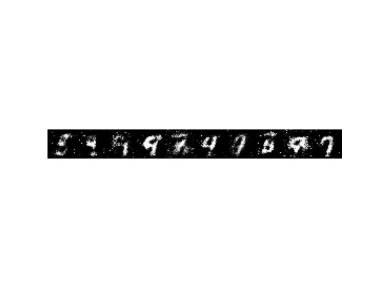

# Generative Adversarial Networks

**Paper:** [Generative Adversarial Networks (Ian J. Goodfellow et al., 2014)](https://arxiv.org/abs/1406.2661)

---

## Problem
Previous generative models attempted to explicitly approximate the probability distribution of training data, \( p_{data}(x) \), which is computationally prohibitive.  
For example, maximum likelihood estimation (MLE)-based generative models (e.g., Boltzmann Machines, Variational Autoencoders) require complex integrations to compute the **normalizing constant** and rely on **approximate inference** to estimate gradients.  
These steps make both training and inference slow and inefficient.

---

## Proposed Idea
The paper introduces **Adversarial Training** to address these limitations.  
Instead of modeling the data distribution explicitly, two networks — a **Generator (G)** and a **Discriminator (D)** — are trained in a competitive setup.

- **Generator \( G(z) \)** maps a latent vector \( z \sim \mathcal{N}(0, I) \) to the data space, producing a fake sample \( x_{fake} \).  
- **Discriminator \( D(x) \)** attempts to distinguish real samples \( x \sim p_{data} \) from fake samples \( G(z) \).

The training objective is formulated as a **minimax game**:

$$
\min_G \max_D V(D, G)
= \mathbb{E}_{x \sim p_{data}}[\log D(x)]
+ \mathbb{E}_{z \sim p_z}[\log(1 - D(G(z)))]
$$

During training, \( D \) improves its ability to classify real vs. fake data, while \( G \) learns to generate samples that fool \( D \).  
At convergence, the generator’s distribution \( p_g(x) \) matches the real data distribution \( p_{data}(x) \).

---

## Results
- The trained generator successfully produces realistic samples on datasets such as **MNIST** and **CIFAR-10**, closely resembling real data drawn from \( p_{data} \).
- The original GAN framework later inspired many variants, including **DCGAN**, **WGAN**, and **StyleGAN**.

---

## Example Result (MNIST)

Below is an example of images generated by the trained Generator on MNIST:

